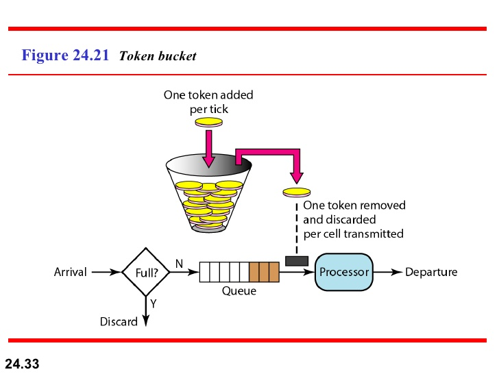

# FluentTokenBuckets
Fluent token bucket algorithm in C#

These token buckets can be used for rate limiting, e.g. in a CQRS pipeline.

Based on:
* http://amistrongeryet.blogspot.com/2011/01/rate-limiting-in-150-lines-or.html
* https://scriptbucket.wordpress.com/2012/01/01/token-bucket-algorithm-in-c/

(Image source: https://www.slideshare.net/WayneJonesJnr/ch24-3361681)
